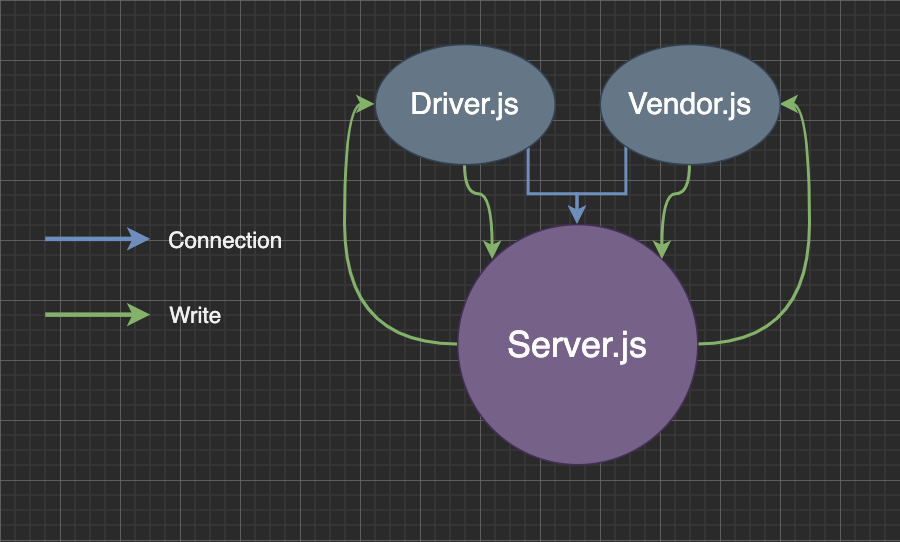

# LAB - Class 17
## Lab 17 - TCP Server
### Author: Clayton Jones

### Links and Resources  

[submission PR](https://github.com/claytonjones-401n16/lab-16/pull/2)  

### Setup  
  
#### How to initialize/run your application (where applicable)
Open three (3) terminal windows
Navigate to /csps, /vendor, and /driver, one in each terminal

`npm i` inside root and /vendor THEN   
`npm start` in each terminal this order:
1. csps
2. driver
3. vendor
  
#### Tests  

No tests available

#### UML  

