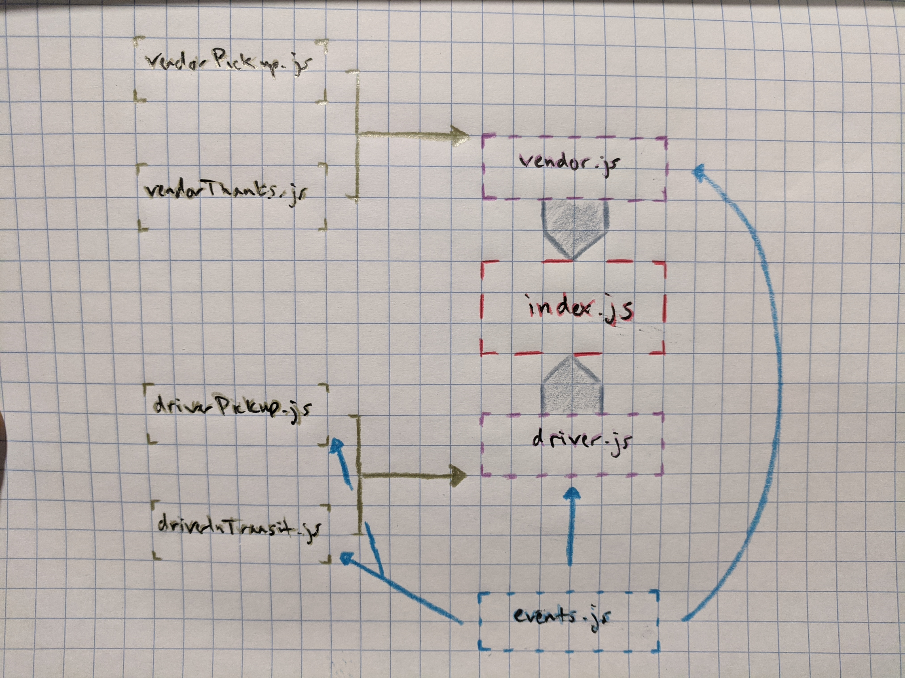

# LAB - Class 16
## Lab 16 - Event Driven Application
### Author: Clayton Jones

### Links and Resources  

[submission PR](https://github.com/claytonjones-401n16/lab-16/pull/1)  
[GitHub Actions](https://github.com/claytonjones-401n16/lab-16/actions)  

### Setup  
  
#### How to initialize/run your application (where applicable)
`npm i` THEN  
`node index.js` OR  
`npm start`  
  
#### Tests  

How do you run tests?
- `npm test`

#### UML  

